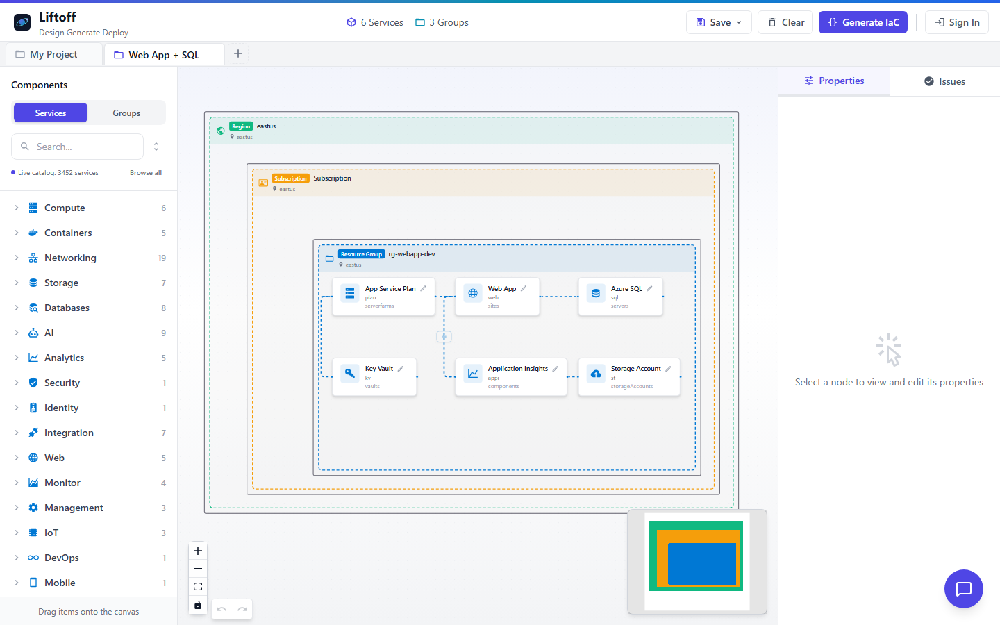
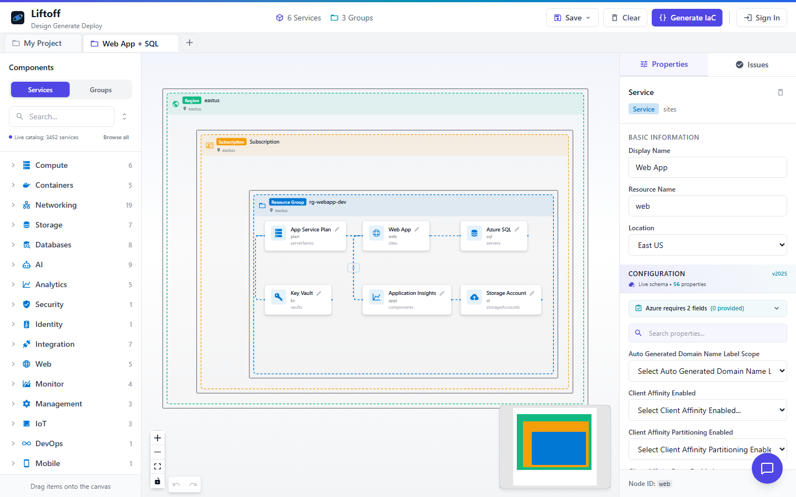
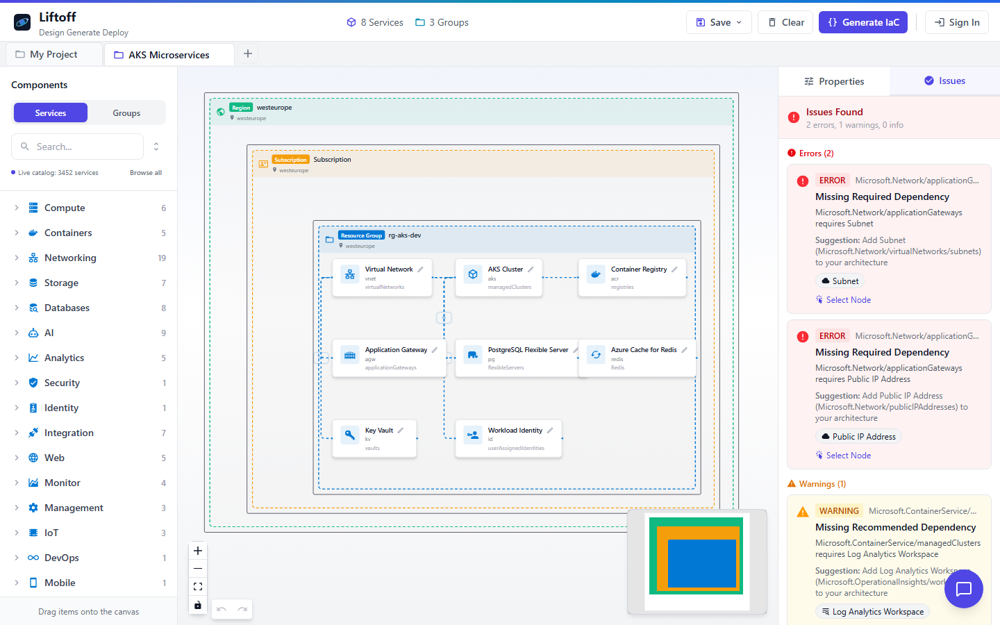
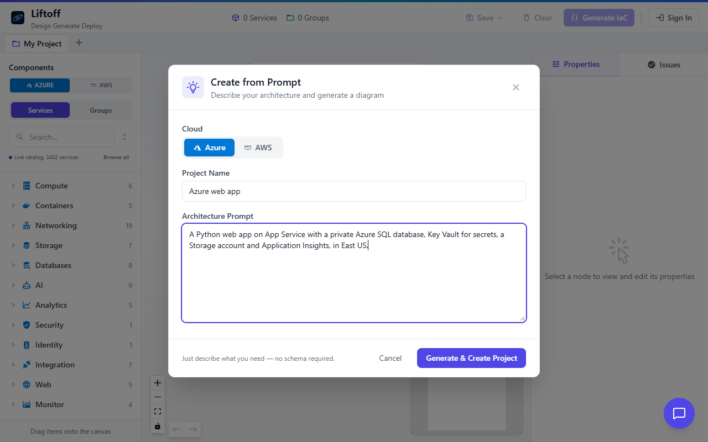
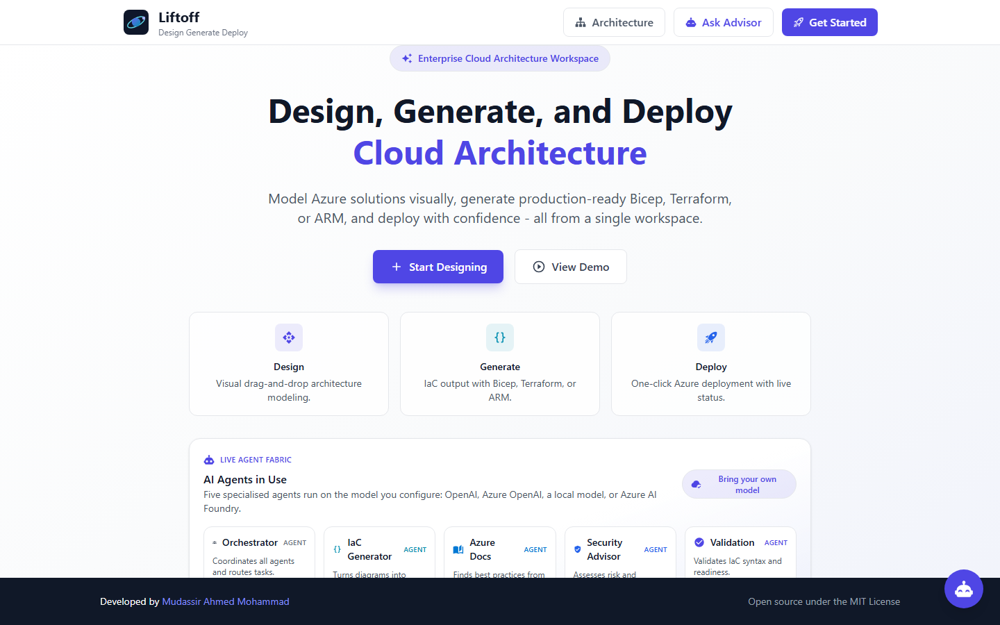
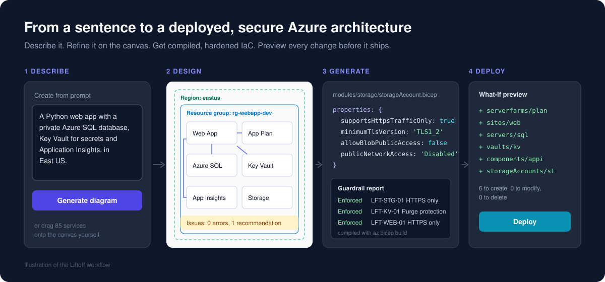
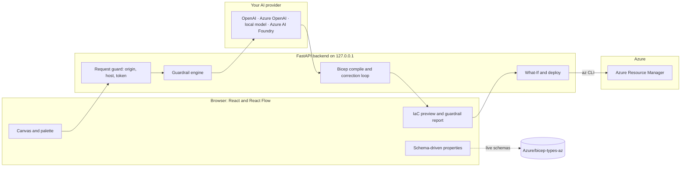

# Liftoff

**From idea to liftoff. Type a sentence, get a secure Azure architecture you can actually deploy.**

[](https://github.com/mdmudassirahmed/liftoff/actions/workflows/ci.yml)
[](LICENSE)




Liftoff is an open-source architecture designer for Azure. Describe a system in plain
English or draw it on a canvas, and Liftoff turns it into modular Bicep or Terraform
that is **hardened against 106 security controls, compiled before you see it, and
previewed with Azure What-If before anything touches your subscription.**

It runs on your machine, deploys with your own Azure sign-in, and works with the model
you already have: OpenAI, Azure OpenAI, a local model through Ollama or LM Studio, or
Azure AI Foundry.

[Quick start](#quick-start) &nbsp;|&nbsp; [First session](#a-first-session) &nbsp;|&nbsp; [How it works](#how-it-works) &nbsp;|&nbsp; [FAQ](#faq) &nbsp;|&nbsp; [Contributing](CONTRIBUTING.md)

## Why Liftoff

| The usual way | With Liftoff |
|---------------|---------------|
| A diagram in one tool, templates in another, drifting apart | The diagram *is* the source of the templates |
| Looking up every property name and API version in the docs | Property panels come straight from Azure's own Bicep type definitions |
| AI-written templates that invent properties and fail to compile | Output is compiled with `az bicep build`, and compiler errors are sent back for automatic correction |
| Public endpoints and shared keys left on by default | HTTPS-only, TLS 1.2, private access, managed identity and RBAC baked into every prompt |
| "What will this actually change?" answered after the deploy | A streamed What-If preview of every create, modify and delete, first |
| Security review as a separate, late step | A per-template report showing which controls are enforced |

> Every architecture starts as an idea on a whiteboard. Liftoff is the moment it leaves
> the ground: designed, secured, checked and running in Azure.

## What happens at each step

The diagram is the source of truth, and every stage has its own check:

| Step | What Liftoff does |
|------|--------------------|
| Design | Property panels are built from the live [Azure Bicep type definitions](https://github.com/Azure/bicep-types-az), so fields, allowed values and required flags match what Azure Resource Manager accepts. Missing dependencies are flagged as you draw. |
| Generate | Before the model writes a line, the prompt is loaded with exact secure settings for every resource in the diagram: HTTPS only, TLS 1.2, no anonymous blob access, purge protection, managed identity with least-privilege RBAC, private connectivity. |
| Verify | Output is compiled with `az bicep build`. Compiler errors go back to the model for up to two correction rounds. Deterministic checks then report which security controls the template actually enforces. |
| Deploy | An Azure What-If run streams every create, modify and delete to the UI before anything is applied. |

## What you get

Generate from the bundled web app example and you get a modular project like this:

```
main.bicep                        orchestrates the modules
parameters/dev.parameters.json    environment parameters
modules/compute/appServicePlan.bicep
modules/compute/webApp.bicep
modules/database/sqlServer.bicep
modules/security/keyVault.bicep
modules/storage/storageAccount.bicep
README.md                         deployment steps for this template
```

with resources hardened by default (abridged):

```bicep
resource storage 'Microsoft.Storage/storageAccounts@2022-09-01' = {
  name: storageAccountName
  location: location
  kind: 'StorageV2'
  sku: { name: 'Standard_LRS' }
  properties: {
    supportsHttpsTrafficOnly: true
    minimumTlsVersion: 'TLS1_2'
    allowBlobPublicAccess: false
    publicNetworkAccess: 'Disabled'
    networkAcls: { defaultAction: 'Deny', bypass: 'AzureServices' }
  }
}
```

and a compliance report alongside it:

| Control | Resource | Status |
|---------|----------|--------|
| LFT-STG-01 Secure transfer required | Storage account | Enforced |
| LFT-STG-02 Anonymous blob access disabled | Storage account | Enforced |
| LFT-KV-01 Purge protection enabled | Key Vault | Enforced |
| LFT-WEB-01 HTTPS only | Web App | Enforced |
| LFT-SQL-02 Entra-only authentication | SQL server | Recommended |

Every control maps to a [Microsoft Cloud Security Benchmark](https://learn.microsoft.com/security/benchmark/azure/)
control and, where one exists, the built-in Azure Policy that audits it.

## Screenshots

**Properties come from Azure's own schema.** Select a resource and the panel shows its
real properties (56 for a Web App), with required fields called out first.



**Problems surface while you design.** The Issues panel flags missing required and
recommended dependencies and offers the fix.



**Start from a sentence.** Describe the architecture and Liftoff generates the diagram.



**The landing page.**



The whole flow at a glance:



## Features

- **Prompt to diagram.** "A Python web app with a private SQL database, Key Vault and
  Application Insights" becomes a nested region, subscription, resource group and
  services layout you can edit.
- **Visual designer.** 85 Azure services, grouping by region, subscription, resource
  group, virtual network and subnet, with properties inherited down the hierarchy.
- **Schema-driven properties.** Required fields first, enums as dropdowns, current
  API versions, straight from the Bicep type definitions.
- **Architecture validation.** An App Service without a plan, a private endpoint
  without a network, and similar gaps show up in the Issues panel.
- **Modular IaC.** Bicep by default, Terraform and ARM on request, downloadable as a ZIP.
- **Security guardrails.** 106 controls across 42 Azure services and platform
  settings, with a pass/fail report per template.
- **What-If and deploy.** Streaming preview, then `az deployment group create`.
- **Architecture advisor.** A chat assistant grounded in Microsoft Learn that sees
  the diagram on your canvas.
- **Landing-zone mode.** For estates where a platform team owns networking, generated
  code references existing virtual networks instead of creating them.

## Quick start

Requirements: Node.js 20 or later and Python 3.10 or later. The
[Azure CLI](https://learn.microsoft.com/cli/azure/install-azure-cli) is needed only for
What-If and deployment.

```bash
git clone https://github.com/mdmudassirahmed/liftoff.git
cd liftoff

./scripts/dev.sh                                             # macOS / Linux
powershell -ExecutionPolicy Bypass -File .\scripts\dev.ps1   # Windows
```

The script installs dependencies on the first run and starts both services. Open
**http://localhost:5173**. The API and its interactive docs are at
http://127.0.0.1:8000/docs.

<details>
<summary>Starting the backend and frontend separately</summary>

```bash
# Terminal 1: backend
cd backend
python -m venv .venv
source .venv/bin/activate        # Windows: .venv\Scripts\activate
pip install -r requirements.txt
uvicorn main:app --reload

# Terminal 2: frontend
cd frontend
npm install
npm run dev
```

</details>

No configuration is required to start.

### What works without any Azure setup

| Capability | Requirement |
|------------|-------------|
| Canvas, service palette, grouping, drag and drop | None |
| Importing the [examples](examples/) or your own diagram JSON | None |
| Schema-driven property editor | Internet access (public Bicep type definitions) |
| Dependency validation and the Issues panel | None |
| Saving to the browser and exporting diagram JSON | None |
| Prompt to diagram, IaC generation, guardrail report, advisor chat | Any chat model: an OpenAI key, Azure OpenAI, a local model, or Azure AI Foundry ([setup](#enabling-the-ai-features)) |
| What-If preview and deployment | Azure CLI signed in with `az login` |

## A first session

1. On the landing page choose **Get Started** to open the workspace.
2. Load an example. The quickest way is a deep link, which opens the example directly:

   - http://localhost:5173/workspace?example=web-app-sql
   - http://localhost:5173/workspace?example=serverless-ai
   - http://localhost:5173/workspace?example=aks-microservices

   Add `&select=web` to open a resource's properties, or `&panel=issues` to open the
   Issues panel. You can also click **+** next to the tabs, choose **Import from JSON**,
   and load a file from `examples/`:

   | File | Architecture |
   |------|--------------|
   | [`examples/web-app-sql.json`](examples/web-app-sql.json) | Python web app on App Service with Azure SQL, Key Vault, Storage and Application Insights |
   | [`examples/serverless-ai.json`](examples/serverless-ai.json) | Function App with Azure OpenAI, Cosmos DB, Service Bus, Key Vault and Storage |
   | [`examples/aks-microservices.json`](examples/aks-microservices.json) | AKS behind an Application Gateway WAF, with Container Registry, PostgreSQL, Redis and workload identity |

3. Select any resource. The properties panel on the right shows its real Azure
   properties, loaded from the Bicep schema.
4. Delete the App Service Plan in the web app example. The Issues panel reports that
   the Web App has lost a required dependency. Add a plan back from the palette.
5. With AI enabled, choose **Generate IaC**, pick Bicep or Terraform, and leave modular
   output on. Review the files and the guardrail report.
6. Signed in to Azure, select a subscription and an existing resource group, run
   **What-If**, read the planned changes, then **Deploy**.
7. Open the advisor chat and ask something about the diagram, for example
   *"How would I make this zone-redundant?"*

To start from a sentence instead, choose **+** then **Create from Prompt** and try:

- *A Python web app on App Service with a private Azure SQL database, Key Vault for secrets and Application Insights.*
- *An event-driven order pipeline: a Function App triggered by Service Bus, writing to Cosmos DB, with Storage for receipts.*
- *A retrieval-augmented chatbot with App Service, Azure OpenAI, Azure AI Search and a Storage account for documents in West Europe.*
- *Three microservices on AKS behind an Application Gateway with WAF, pulling images from a private Container Registry.*

## Enabling the AI features

Diagram generation, IaC generation and the advisor are five specialised agents
(orchestrator, IaC generator, documentation, security advisor, validator). Each is a
system prompt that runs on whichever chat model you configure. Copy
`backend/.env.example` to `backend/.env`, set **one** of the options below, and restart
the backend.

| Provider | Settings in `backend/.env` |
|----------|----------------------------|
| **OpenAI** | `OPENAI_API_KEY=sk-...` and optionally `AI_MODEL=gpt-4.1` |
| **Local model** (Ollama, LM Studio, vLLM, any OpenAI-compatible server) | `OPENAI_BASE_URL=http://localhost:11434/v1` and `AI_MODEL=llama3.1` (Ollama example) |
| **Azure OpenAI** | `AZURE_OPENAI_ENDPOINT=https://<resource>.openai.azure.com/` and `AZURE_OPENAI_DEPLOYMENT=<deployment>`. Keyless through `az login`, or set `AZURE_OPENAI_API_KEY` |
| **Azure AI Foundry agents** | `AZURE_AI_PROJECT_ENDPOINT=...` after creating the agents once with `agents/create_agents.py` (keyless through `az login`) |

`AI_PROVIDER=auto` (the default) uses the first option that is set; set it to `openai`,
`azure-openai` or `foundry` to choose explicitly. Until a provider is configured, AI
endpoints return HTTP 503 with instructions and the rest of the application keeps
working.

Generation quality depends on the model. The Bicep compile-and-correct loop and the
deterministic guardrail checks apply to every provider, so weaker models still produce
templates that compile and are verified; they may just need more correction rounds.

## How it works



The frontend is React 19 with TypeScript, Vite, Tailwind and React Flow. The backend
is FastAPI. Five agents (orchestrator, IaC generator, documentation, security advisor,
validator) are system prompts in `backend/app/agents/prompts.py`, run on the model you
configure. On Azure AI Foundry the same prompts are installed as hosted agents, where
the documentation agent additionally uses the Microsoft Learn MCP server.

## Configuration

Every setting has a safe default.

| File | Settings |
|------|----------|
| `backend/.env` ([example](backend/.env.example)) | `AI_PROVIDER`, `AI_MODEL`, `OPENAI_API_KEY`, `OPENAI_BASE_URL`, `AZURE_OPENAI_*`, `AZURE_AI_PROJECT_ENDPOINT`, `CORS_ORIGINS`, `ALLOWED_HOSTS`, `API_AUTH_TOKEN`, `GUARDRAILS_ENABLED`, `IAC_REFERENCE_EXISTING_NETWORKS` |
| `frontend/.env.local` ([example](frontend/.env.example)) | `VITE_API_URL`, `VITE_API_TOKEN` |
| `agents/.env` ([example](agents/.env.example)) | `AZURE_AI_PROJECT_ENDPOINT`, `AZURE_AI_MODEL_DEPLOYMENT_NAME` |

All `.env` files are ignored by git.

## Security model

The backend runs Azure CLI commands with your identity, so it is built as a
single-user tool that runs on your machine:

- it listens on `127.0.0.1` only,
- it rejects cross-site requests and unexpected `Host` headers (DNS rebinding),
- it can require a bearer token (`API_AUTH_TOKEN`),
- every value passed to `az` is validated, commands run without a shell, and
  uploaded template paths cannot leave a temporary directory,
- it holds no keys: Azure AI Foundry is reached through `DefaultAzureCredential`.

Read [SECURITY.md](SECURITY.md) before running it for other people, and to report a
vulnerability privately.

## FAQ

**Where does my data go?** Your diagram is sent to your own Azure AI Foundry project
when you use an AI feature. The browser downloads public schema and icon data from
GitHub, `schema.management.azure.com` and the Iconify API. The advisor queries
Microsoft Learn. There is no telemetry.

**Does it support AWS or Google Cloud?** Not today. The guardrail engine and catalog
are keyed by cloud provider, so adding one is a contained piece of work.

**Which models can I use?** Anything with an OpenAI-compatible chat API: OpenAI,
Azure OpenAI, local models through Ollama or LM Studio, hosted gateways such as
OpenRouter, or Azure AI Foundry agents. Pick one in `backend/.env`. The agents are
plain system prompts (`backend/app/agents/prompts.py`), so you can also tune them.

**Can I trust the generated code blindly?** No. It is compiled, checked and previewed,
which removes most of the usual failure modes, but review it like any other pull
request before it reaches production.

## Troubleshooting

| Symptom | Fix |
|---------|-----|
| "AI features are not configured" or HTTP 503 | Expected until you [enable the AI features](#enabling-the-ai-features). |
| "Could not connect to Azure AI Foundry" | Run `az login`, check `AZURE_AI_PROJECT_ENDPOINT`, and confirm the Azure AI User role on the project. |
| The deploy panel says you are not authenticated | Run `az login` on the machine running the backend, then refresh the status. |
| What-If fails with `ResourceGroupNotFound` | Deployments target an existing resource group: `az group create -n <name> -l <region>`. |
| "Origin not allowed" (HTTP 403) in the browser console | Add the address you opened the UI from to `CORS_ORIGINS` in `backend/.env`. |
| "Invalid host header" (HTTP 400) | Add the hostname to `ALLOWED_HOSTS` in `backend/.env`. |
| The properties panel is empty | The schema is fetched from `raw.githubusercontent.com`; check your network or proxy. |
| Port 5173 or 8000 is already in use | Run `npm run dev -- --port 5174` and `uvicorn main:app --port 8001`, then update `VITE_API_URL` and `CORS_ORIGINS`. |

## Project layout

```
backend/    FastAPI API, guardrail engine, Foundry client, Azure CLI deployment
frontend/   React application: canvas, property editor, IaC preview, deploy flow
agents/     Scripts that create, test and delete the Azure AI Foundry agents
examples/   Diagrams you can import straight away
docs/       Design notes
scripts/    Development launchers
```

## Development

```bash
cd backend && pip install -r requirements-dev.txt && pytest && ruff check .
cd frontend && npm test && npm run lint && npm run build
```

Continuous integration runs these checks and a secret scan on every push and pull request.

## Roadmap

- Per-user Microsoft Entra sign-in instead of the shared Azure CLI identity
- Import of architecture documents and images
- Terraform plan preview next to Bicep What-If
- Cost estimates on the canvas

The schema catalog design is described in
[docs/dynamic-schema-canvas-plan.md](docs/dynamic-schema-canvas-plan.md).

## Contributing

New guardrails, dependency rules, example diagrams, fixes and documentation are all
welcome. [CONTRIBUTING.md](CONTRIBUTING.md) explains how to get set up and where each
kind of change lives.

## License

[MIT](LICENSE). Copyright (c) 2026 Mudassir Ahmed Mohammad.

Azure, Bicep and related marks are trademarks of Microsoft. Liftoff is an
independent project and is not affiliated with or endorsed by Microsoft.
